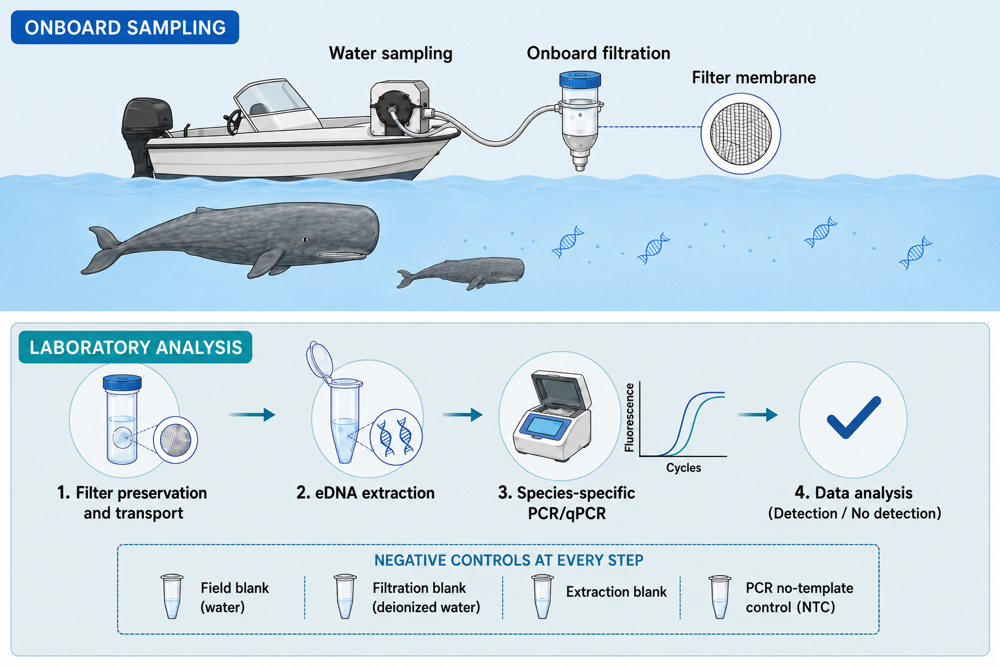

## Introduction

Environmental DNA, or **eDNA**, is DNA released by organisms into their environment through skin cells, mucus, feces, urine, or other biological material.  
In marine environments, eDNA can be collected from seawater and used to detect the presence of marine species, including whales and dolphins, such as the sperm whale (*Physeter macrocephalus*).

This protocol describes a basic onboard sampling and filtration workflow for detecting the sperm whale using species-specific PCR/qPCR.  
The goal is to collect seawater, filter it onboard, preserve the filter membrane, and later extract DNA in the laboratory.

<u>This protocol is intended for educational and research-method practice purposes.</u>

---

## Aim of the Protocol

### Main objective

To collect and preserve seawater samples for **environmental DNA analysis** in order to detect sperm whale DNA.

### Specific objectives

- Collect seawater from a selected sampling site.
- Filter the water onboard using a membrane filter.
- Preserve and transport the filter to the laboratory.
- Extract eDNA from the filter.
- Use PCR or qPCR for species-specific detection of the sperm whale.
- Include negative controls at every step to reduce contamination risk.

---

## Background

Marine mammals are often difficult to monitor because they spend most of their time underwater and may occur at low densities.  
Traditional methods such as visual surveys and acoustic monitoring are important, but eDNA can provide an additional non-invasive tool for detection.

For example, eDNA has been used to detect cetaceans in marine environments and can complement traditional monitoring methods.

### Target species

The target species in this protocol is the sperm whale.

Scientific reference:  
[Environmental DNA metabarcoding for detecting marine mammals](https://pmc.ncbi.nlm.nih.gov/articles/PMC8019034/)

---

## Field and Laboratory Workflow

Figure 1: Onboard water sampling, filtration, filter preservation, eDNA extraction, sperm whale species-specific PCR/qPCR, and data analysis workflow.

---

## Required Equipment and Materials

### Field equipment

- Research boat
- Sterile water sampling bottles
- Peristaltic pump or manual filtration system
- Sterile tubing
- Filter holder
- Sterile membrane filters
- Gloves
- Cooler with ice packs
- Labels and waterproof marker
- Field notebook or digital data sheet

### Laboratory equipment

- DNA extraction kit
- Sterile tubes
- Pipettes and sterile tips
- PCR/qPCR machine
- PCR reagents
- Species-specific primers
- Negative controls

Online protocol for an instrument or chemical:  
[DNeasy Blood & Tissue Kit Handbook – Qiagen](https://www.qiagen.com/us/resources/resourcedetail?id=68f29296-5a9f-40fa-8b3d-1c148d0b3030&lang=en)

---

## Sampling Table Example

Table 1: Example of metadata collected during eDNA water sampling.

| Sample ID | Date | Site | GPS coordinates | Water volume (L) | Filter type |
|-----------|------|------|-----------------|------------------|-------------|
| S01 | 2026-05-01 | Haifa slope | 32.83, 34.95 | 5 | 0.45 µm membrane |
| S02 | 2026-05-01 | Haifa slope | 32.84, 34.96 | 5 | 0.45 µm membrane |
| S03 | 2026-05-01 | Carmel coast | 32.76, 34.91 | 5 | 0.45 µm membrane |
| S04 | 2026-05-02 | Carmel coast | 32.75, 34.90 | 5 | 0.45 µm membrane |
| S05 | 2026-05-02 | Offshore station | 32.90, 34.80 | 5 | 0.45 µm membrane |
| S06 | 2026-05-02 | Offshore station | 32.91, 34.81 | 5 | 0.45 µm membrane |

---

## Step-by-Step Protocol

### 1. Preparation before sampling

Before going to the field, prepare all sampling bottles, filters, tubes, and labels.  
All equipment should be clean and handled with gloves to reduce the risk of contamination.

**Important:** each sample must have a unique sample ID.

---

### 2. Water sampling

1. Select the sampling location.
2. Record the date, time, GPS location, sea conditions, and sample ID.
3. Collect seawater using a sterile bottle or tubing connected to the pump.
4. Avoid touching the inside of the bottle, tube, or filter holder.
5. Prepare a field blank using sterile water to check for contamination during fieldwork.

---

### 3. Onboard filtration

1. Connect the sterile tubing to the filtration system.
2. Place a sterile membrane filter inside the filter holder.
3. Filter the selected volume of seawater.
4. If the filter clogs, record the final filtered volume.
5. After filtration, carefully remove the filter using sterile forceps.

*The filter membrane is the part that captures cells and free DNA particles from the seawater.*

---

### 4. Filter preservation and transport

1. Place the filter into a sterile tube.
2. Add preservation buffer if required by the laboratory protocol.
3. Label the tube clearly.
4. Store the tube in a cooler with ice packs during transport.
5. Transfer the samples to a freezer as soon as possible.

---

### 5. eDNA extraction

In the laboratory, DNA is extracted from the filter using a DNA extraction kit.  
The extraction process breaks open cells and releases DNA into solution.

An extraction blank should be included to test for contamination during this step.

---

### 6. Species-specific PCR/qPCR

Species-specific primers are used to test whether DNA from the target species, the sperm whale, is present in the sample.  
PCR or qPCR results can show either detection or no detection of the target species.

A PCR no-template control, also called NTC, must be included.

---

## Negative Controls

Negative controls are essential in eDNA studies because contamination can lead to false-positive results.

### Recommended controls

- **Field blank**: sterile water opened during field sampling.
- **Filtration blank**: sterile or deionized water filtered onboard.
- **Extraction blank**: empty extraction tube processed with the samples.
- **PCR no-template control**: PCR reaction with water instead of DNA template.

---

## Expected Results

If target DNA is present, PCR/qPCR amplification may be detected.  
If no target DNA is present, there should be no amplification.

Results should be interpreted carefully because eDNA detection can be influenced by water movement, DNA degradation, sampling volume, and the distance from the animal.

---

## Notes and Limitations

- eDNA detection does not always prove that the animal is present at the exact sampling point.
- DNA may be transported by currents.
- Negative results do not always mean the species is absent.
- Contamination prevention is very important.
- eDNA should be used together with visual surveys, acoustic surveys, or other monitoring methods when possible.

---

## References

1. [Environmental DNA metabarcoding for detecting marine mammals](https://pmc.ncbi.nlm.nih.gov/articles/PMC8019034/)  
2. [DNeasy Blood & Tissue Kit Handbook – Qiagen](https://www.qiagen.com/us/resources/resourcedetail?id=68f29296-5a9f-40fa-8b3d-1c148d0b3030&lang=en)  
3. [Environmental DNA: a review of the possible applications for the detection of marine organisms](https://www.sciencedirect.com/science/article/pii/S0964569114001699)

---

## Summary

This protocol presents a basic workflow for eDNA sampling from seawater for sperm whale detection.  
It includes onboard water sampling, filtration, filter preservation, DNA extraction, PCR/qPCR analysis, and the use of negative controls at every step.
