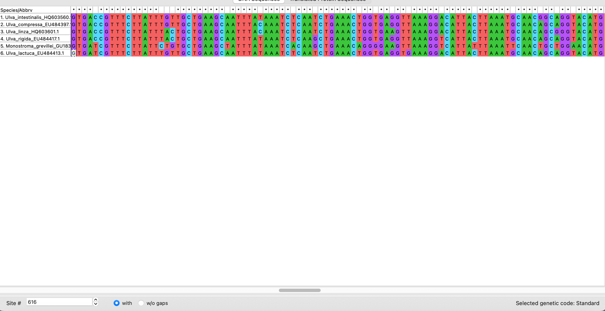
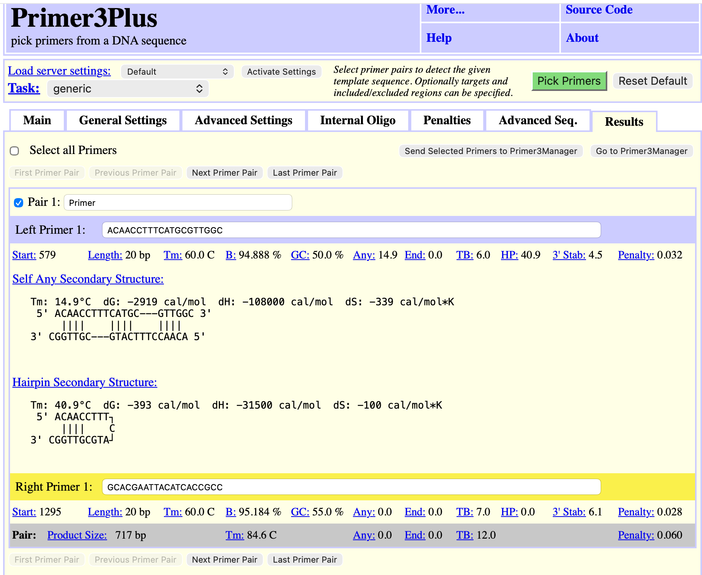
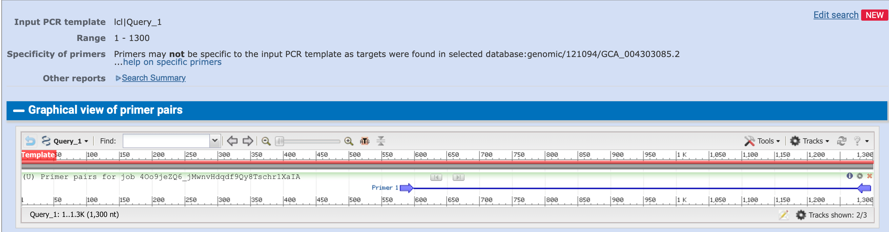
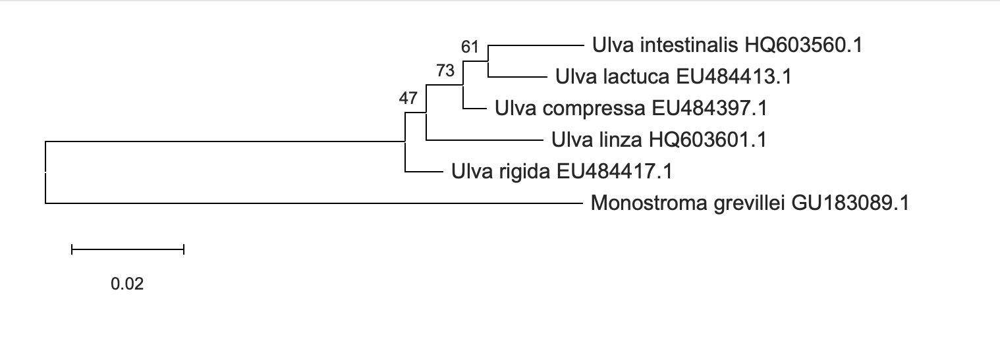

# Primer Design and Phylogenetic Analysis of *Ulva lactuca* Using the rbcL Gene

## Objective

The objective of this project was to document a bioinformatics workflow for algal species identification.

The workflow included two main parts:

1. Designing primers for algal species identification using the **rbcL** gene.
2. Constructing a phylogenetic tree for the target organism and related algal species.

The target organism selected for this project was *Ulva lactuca*.

---

## Target Organism and Barcode Region

The selected target organism was *Ulva lactuca*, a green algal species.

The barcode region selected for this analysis was the **rbcL gene**, which codes for the large subunit of ribulose-1,5-bisphosphate carboxylase/oxygenase.

The rbcL gene was selected because it is commonly used for species identification in photosynthetic organisms, including algae. It contains conserved regions that are suitable for primer binding and variable regions that can help distinguish between related species.

The goal of the primer design was to identify a suitable primer pair that can amplify part of the rbcL gene.

The goal of the phylogenetic analysis was to examine whether *Ulva lactuca* clusters with closely related *Ulva* species.

---

## Sequence Collection from NCBI

DNA sequences were collected from the NCBI GenBank database.

The search was performed using the species name together with the selected gene name, for example:

- *Ulva lactuca* rbcL
- *Ulva intestinalis* rbcL
- *Ulva compressa* rbcL
- *Ulva linza* rbcL
- *Ulva rigida* rbcL
- *Monostroma grevillei* rbcL

The dataset included one target organism, four related species from the genus *Ulva*, and one outgroup species.

| Species | Role in analysis | Gene / barcode region | Accession number | Source |
|---|---|---|---|---|
| *Ulva lactuca* | Target organism | rbcL | EU484413.1 | NCBI GenBank |
| *Ulva intestinalis* | Related species | rbcL | HQ603560.1 | NCBI GenBank |
| *Ulva compressa* | Related species | rbcL | EU484397.1 | NCBI GenBank |
| *Ulva linza* | Related species | rbcL | HQ603601.1 | NCBI GenBank |
| *Ulva rigida* | Related species | rbcL | EU484417.1 | NCBI GenBank |
| *Monostroma grevillei* | Outgroup | rbcL | GU183089.1 | NCBI GenBank |

The sequences were downloaded in FASTA format and saved in one file for further analysis.

---

## Multiple Sequence Alignment

The rbcL sequences were aligned using **MEGA** with the **ClustalW** alignment method.

The sequence type was DNA.

The alignment included the target organism *Ulva lactuca*, four closely related *Ulva* species, and the outgroup *Monostroma grevillei*.

The alignment was used to identify conserved and variable regions. Conserved regions were considered suitable primer-binding sites, while variable regions containing nucleotide substitutions or gaps were useful for distinguishing between closely related algal species.

**Figure 1.** Multiple sequence alignment of rbcL sequences from *Ulva lactuca*, related *Ulva* species, and the outgroup *Monostroma grevillei*.

---

## Conserved and Variable Regions

The multiple sequence alignment showed several conserved regions shared by most of the *Ulva* species. These conserved regions are useful for primer binding because primers should attach to stable regions of the gene.

Variable regions were also observed between the sequences. These included nucleotide substitutions and gaps. Such variable sites may help distinguish between closely related algal species after sequencing the PCR product.

In this workflow, conserved regions flanking a variable region were used as the basis for primer design.

---

## Primer Design Using Primer3Plus

Primers were designed using **Primer3Plus** based on the rbcL sequence of *Ulva lactuca*.

A single clean DNA sequence was used as the template sequence. The multiple sequence alignment was not used directly in Primer3Plus because primer design requires one clean sequence without gaps or alignment symbols.

Primer design parameters included:

| Parameter | Selected / Preferred value |
|---|---|
| Primer length | 18–25 bp |
| Optimal primer length | 20 bp |
| Melting temperature, Tm | Approximately 60°C |
| GC content | 40–60% |
| Expected product size | 300–800 bp |

The selected primer pair was:

| Primer | Sequence 5’ → 3’ | Start | Stop | Length | Tm | GC% | Expected amplicon size |
|---|---|---:|---:|---:|---:|---:|---:|
| Forward primer | ACAACCTTTCATGCGTTGGC | 579 | 598 | 20 bp | 60.0°C | 50.0% | 717 bp |
| Reverse primer | GCACGAATTACATCACCGCC | 1295 | 1276 | 20 bp | 60.0°C | 55.0% | 717 bp |

The selected primer pair had suitable primer length, melting temperature, GC content, and expected amplicon size.

**Figure 2.** Primer3Plus results showing the selected primer pair for the rbcL gene of *Ulva lactuca*. The expected amplicon size was 717 bp.

---

## Primer Verification Using NCBI Primer-BLAST

The selected primer pair was verified using **NCBI Primer-BLAST**.

The purpose of this step was to confirm that the primers amplify the expected rbcL region in the input template and to check for possible non-target amplification.

Primer-BLAST confirmed that the primer pair amplified a product of **717 bp** in the input PCR template.

| Primer | Sequence 5’ → 3’ | Template strand | Length | Start | Stop | Tm | GC% |
|---|---|---|---:|---:|---:|---:|---:|
| Forward primer | ACAACCTTTCATGCGTTGGC | Plus | 20 | 579 | 598 | 59.97°C | 50.00% |
| Reverse primer | GCACGAATTACATCACCGCC | Minus | 20 | 1295 | 1276 | 59.97°C | 55.00% |

The Primer-BLAST results showed that the selected primers amplified the expected region of the rbcL gene. However, the results also indicated that the primers may not be completely specific to the input PCR template because potential amplification was found in other sequences in the selected database.

Therefore, these primers may require further optimization before experimental laboratory use. For this bioinformatics workflow, the primer pair was considered suitable for demonstrating primer design and primer specificity verification.

**Figure 3.** NCBI Primer-BLAST results showing the expected 717 bp product and possible non-target amplification.

---

## Phylogenetic Tree Construction

A phylogenetic tree was constructed using **MEGA**.

The aligned rbcL sequences were analyzed using the **Neighbor-Joining** method. Branch support was tested using bootstrap analysis.

The tree-building parameters were:

| Parameter | Value |
|---|---|
| Software | MEGA |
| Sequence type | DNA |
| Alignment method | ClustalW |
| Tree-building method | Neighbor-Joining |
| Substitution model | Kimura 2-parameter |
| Bootstrap replicates | 1000 |
| Rates among sites | Uniform rates |
| Gaps / missing data treatment | Pairwise deletion |
| Outgroup | *Monostroma grevillei* |

**Figure 4.** Neighbor-Joining phylogenetic tree based on rbcL sequences. The tree was constructed in MEGA using the Kimura 2-parameter model and 1000 bootstrap replicates. *Monostroma grevillei* was used as the outgroup. Bootstrap values are shown next to the branches.

---

## Phylogenetic Tree Interpretation

The phylogenetic tree showed that the target organism, *Ulva lactuca*, clustered closely with *Ulva intestinalis*. This relationship was supported by a bootstrap value of 61, indicating moderate support.

*Ulva compressa* was grouped close to the *Ulva lactuca* and *Ulva intestinalis* cluster. The larger clade containing *Ulva intestinalis*, *Ulva lactuca*, and *Ulva compressa* had a bootstrap value of 73, which indicates reasonable support.

*Ulva linza* and *Ulva rigida* were also placed within the *Ulva* group, but they were separated from the main cluster containing *Ulva lactuca*. The bootstrap value of 47 for one internal branch indicates weak support, so this relationship should be interpreted cautiously.

The outgroup, *Monostroma grevillei*, was clearly separated from all *Ulva* species. This supports its use as an outgroup and shows that the rbcL gene provided useful phylogenetic signal for separating the target genus from a more distant related algal species.

Overall, the tree supports the expected taxonomic relationship: *Ulva lactuca* grouped with other species from the genus *Ulva*, while *Monostroma grevillei* was separated from the main *Ulva* cluster.

---

## Conclusion

This bioinformatics workflow demonstrated how the rbcL gene can be used for algal species identification.

Sequences were collected from NCBI GenBank and aligned using MEGA. Conserved and variable regions were identified from the alignment. Primers were designed using Primer3Plus and verified using NCBI Primer-BLAST. Finally, a phylogenetic tree was constructed using MEGA with the Neighbor-Joining method.

The selected primer pair amplified an expected product of 717 bp. However, Primer-BLAST indicated possible non-target amplification, suggesting that further optimization may be needed before experimental use.

The phylogenetic tree supported the expected relationship between *Ulva lactuca* and related *Ulva* species, while *Monostroma grevillei* was separated as the outgroup.

---

## References

1. NCBI GenBank database.
2. NCBI Primer-BLAST.
3. Primer3Plus.
4. MEGA software.
